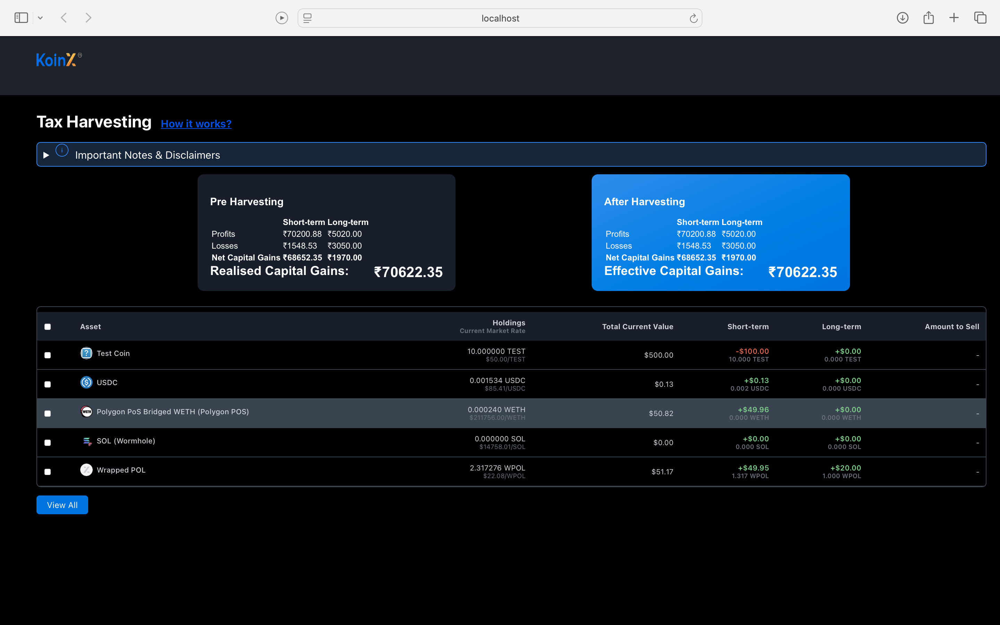

# KoinX Tax Harvesting React App

## Overview
This is a React application for Tax Harvesting, showing Pre-Harvesting and After-Harvesting capital gains, along with a holdings table. The app is responsive and adapts well to mobile devices.

## Folder Structure
- `src/components/` - React components including PreHarvestingCard, AfterHarvestingCard, HoldingsTable, Header, etc.
- `src/styles/` - CSS stylesheets for cards and other UI elements.
- `public/` - Public assets like favicon, logos, and index.html.
- `src/` - Main React app files including App.js, index.js, and tests.

## Setup Instructions

1. Clone the repository:
   ```bash
   git clone https://github.com/sasankkona/Tax-Harvesting.git
   cd Tax-Harvesting
   ```

2. Install dependencies:
   ```bash
   npm install
   ```

3. Start the development server:
   ```bash
   npm start
   ```

4. Open your browser and navigate to:
   ```
   http://localhost:3000
   ```

## Screenshots



## Assumptions
- The app fetches market data from Coingecko API.
- Tax-loss harvesting is not allowed under Indian tax regulations (as per disclaimers).
- The app does not handle derivatives or futures.
- Only realized losses are considered for harvesting.
- The app is designed primarily for desktop and mobile devices with screen widths up to 600px.

## Testing
- Run tests with:
  ```bash
  npm test
  ```
- Note: Some existing tests may fail due to missing elements or React state update warnings.

## License
MIT License
